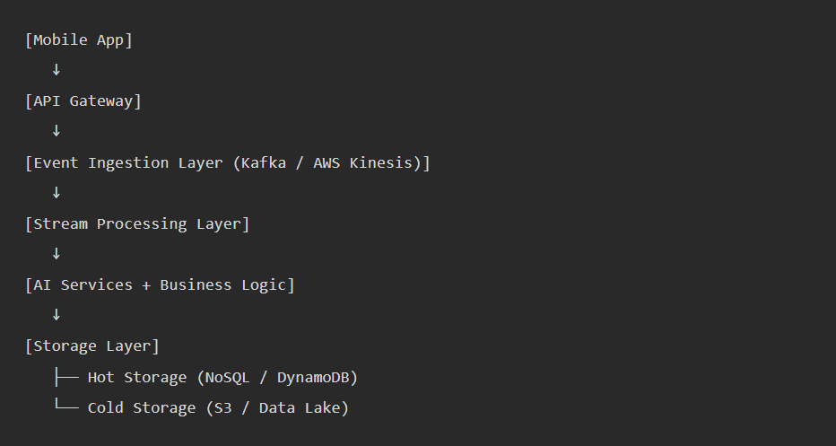

# Product-Strategy-Portfolio
This project outlines a comprehensive plan for developing a new AI-powered grocery management feature, including product requirements, user experience design, technical architecture, and data privacy considerations, aimed at reducing food waste and enhancing user engagement.

##  Technical Architecture
High-Level System Architecture

